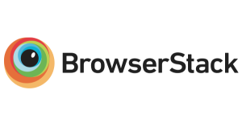

# Introduction

JavaScript bindings that conform to the [W3C WebDriver standard](https://www.w3.org/TR/webdriver) for controlling web browsers.

## Features

- Minimalistic promise based REST client.
- One-to-one mapping to WebDriver API endpoints
- Written in TypeScript for type safety, autocomplete and IntelliSense documentation
- Full feature coverage over 55 WebDriver endpoints
- 100% test coverage in real browsers (Chrome, Firefox, Safari, Internet Explorer)
- Tested on Ubuntu, Windows and MacOS

## Getting started

### 1. Install the package

    npm install w3c-webdriver

### 2. Install a browser driver for WebDriver protocol

- Chrome - [chromedriver](https://www.npmjs.com/package/chromedriver)
- Firefox - [geckodriver](https://www.npmjs.com/package/geckodriver)
- Safari - [safaridriver](https://developer.apple.com/documentation/webkit/testing_with_webdriver_in_safari)
- Internet Explorer - [iedriver](https://www.npmjs.com/package/iedriver)

For example in case of Google Chrome or its headless version you can do.

    npm install chromedriver

Also you can manage the drivers using [webdriver-manager](https://www.npmjs.com/package/webdriver-manager)

### 3. Start the driver as described in the docs

### 4. Control the browser through WebDriver protocol

```javascript
const { newSession } = require('w3c-webdriver');

let session;

(async () => {
  try {
    session = await newSession({
      url: 'http://localhost:4444',
      capabilities: {
        alwaysMatch: {
          browserName: 'chrome'
        }
      }
    });
    await session.navigateTo('http://localhost:8080');
    const input = await session.findElement(
      'css selector',
      '[name="first-name"]'
    );
    await input.sendKeys('Hello World');
  } catch (err) {
    console.log(err.stack);
  } finally {
    session.deleteSession();
  }
})();
```

## We are using

[](https://www.browserstack.com/)

We are using [BrowserStack](https://www.browserstack.com) for testing the Selenium support of current package. BrowserStack loves open source and has sponsored thousands of projects. They offered us a free account as we're an open source project. This makes testing very easy on different browsers and various platforms including real mobile devices.
